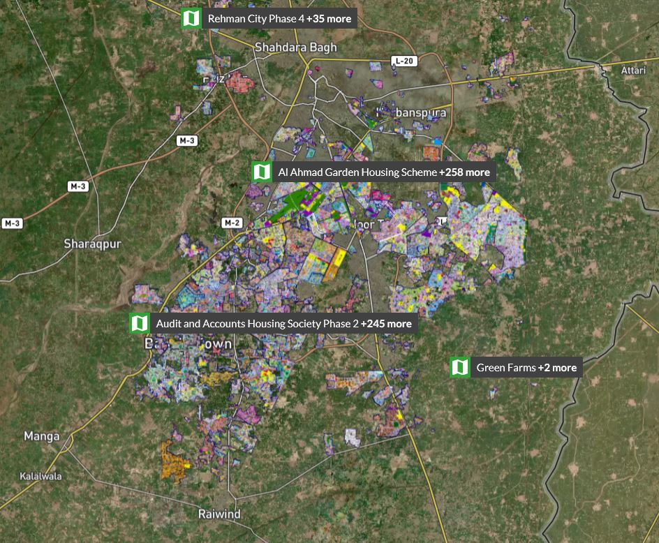
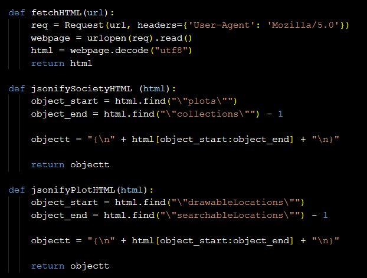
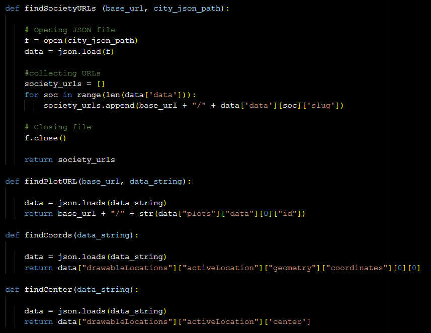
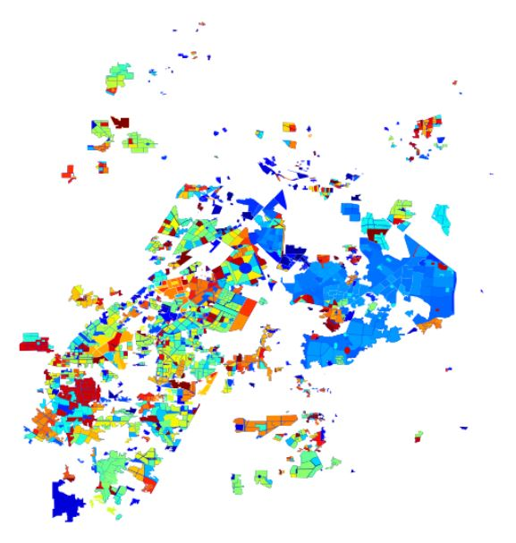

# Web Scraping the Societies in Lahore

This mini project was funded by IDEAS (PI: Fizzah Sajjad) with the objective of getting the housing societies from Zameen websites as GIS shapefiles. GIS shapefiles are supported by many softwares and can be used easily for further analysis. The scraping of societies was done for Lahore from the <a href="https://www.zameen.com/plotfinder/Lahore-28/">city-based URL</a> on Zameen website. One can further view the society boundaries and markings on a street map by specifying a society name. You see the zoomed in Cavalry Ground markings in the image below. 

  
   

Scraping data from plots/maps/images is not as straight forward as scraping text information from the web. Here are some technical details on how scraping from the Zameen plotfinder works: The URL was converted to an html format, that contained the list of all societies for each city. The list of societies was used to iteratively fetch the html files of each individual society. 

## Scraping Society Data
The boundary coordinates, center coordinates, ids and slug names of societies were found in the html files for the individual societies. To fetch these boundary coordinates, we had to further search through the individual plot/buildings in the society. 

Some important functions:

## Output - Saving in GIS-supported format
Each society is saving as a geometric object, namely a polygon, identified with an id, slug name, and center coordinates. The boundary coordinates are saved as irregular shaped polygons.  The polygons are the export in a geo-dataframe object using the geopandas library in python. The data was finally exported as shape files. 
Here is a plot of the societies scraped from Zameen websites look as geo-dataframe objects. This can now be easily used for further analysis.

